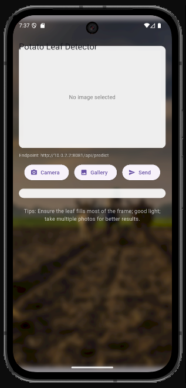
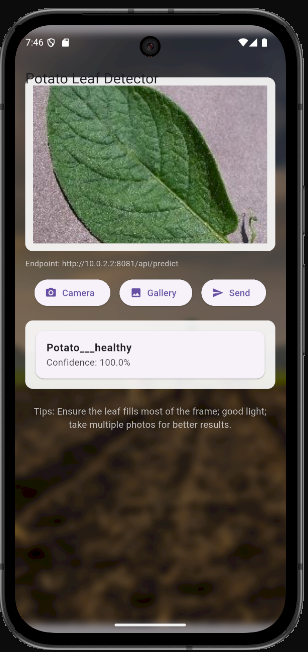
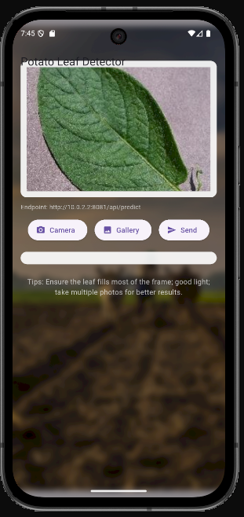
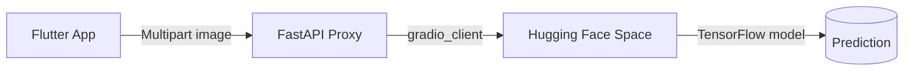

<div align="center">

# 🍃 Potato Disease Classification

Minimal end-to-end project: a Flutter mobile app that predicts potato leaf diseases using a model hosted on a Hugging Face Space, bridged by a tiny FastAPI proxy.

[](https://flutter.dev)
[](https://fastapi.tiangolo.com)
[](https://huggingface.co/spaces)
[](https://www.tensorflow.org)

</div>

---

## ✨ What’s inside

- Flutter app (Android/iOS/Web-capable) to capture/select a leaf photo and get predictions
- FastAPI proxy that forwards requests to the Hugging Face Space reliably (CORS/auth friendly)
- Hugging Face Space running a Gradio UI + TensorFlow model
- Training notebooks and saved model artifacts

---

## 📸 Screenshots


| Home                               | Prediction                               | Gallery                                  |
| ---------------------------------- | ---------------------------------------- | ---------------------------------------- |
|  |  |  |

---

## 🧭 Architecture



- Mobile devices often can’t call Spaces directly (CORS, auth, routing). The proxy makes it reliable and secure.

---

## 🚀 Quick start (local dev)

Prereqs

- Windows/macOS/Linux
- Python 3.10+ (for the proxy)
- Flutter SDK + Android Studio AVD (or a physical device)

1. Start the proxy (PowerShell)

```powershell
Set-Location 'C:\Learn Programming\Machine Learning\potato_disease\proxy'
& 'C:/Learn Programming/Machine Learning/potato_disease/myenv/Scripts/python.exe' -m uvicorn app:app --host 0.0.0.0 --port 8081
```

Health check:

```powershell
Invoke-RestMethod -Uri http://127.0.0.1:8081/health -Method GET
```

2. Configure the Flutter app

Edit `mobile/flutter_app/.env`:

```
HF_RUNTIME=http://10.0.2.2:8081   # Android emulator -> host
HF_TOKEN=                         # leave empty for public Space
```

3. Run the Flutter app

```powershell
Set-Location 'C:\Learn Programming\Machine Learning\potato_disease\mobile\flutter_app'
flutter pub get
flutter run
```

Upload a photo or take one with the camera, then tap Send.

---

## 🔌 Proxy API (local)

- `GET /health` → `{ "status": "ok" }`
- `POST /api/predict` (multipart/form-data)
  - field: `file` (the image bytes)

PowerShell test with a public image URL (via helper endpoint):

```powershell
$body = @{ url = "https://upload.wikimedia.org/wikipedia/commons/3/39/Healthy_potato_leaf.jpg" } | ConvertTo-Json
Invoke-RestMethod -Uri http://127.0.0.1:8081/predict_url -Method POST -Body $body -ContentType 'application/json'
```

---

## ⚙️ Configuration

- Flutter app env: `mobile/flutter_app/.env`

  - `HF_RUNTIME`: Base URL for the proxy (local or production)
  - `HF_TOKEN`: Optional bearer token if your Space is private

- Background image (optional):
  - Place an image at `mobile/flutter_app/assets/images/bg.jpg`
  - Registered in `pubspec.yaml` under `assets/images/`

---

## 🌐 Deploying the proxy (production)

Use any PaaS that gives you an HTTPS URL (Render, Railway, Fly.io, Azure, etc.). Steps are roughly:

1. Create a new service and point it to `proxy/app.py` (ASGI, uvicorn)
2. Set env vars as needed (e.g., `HF_TOKEN` for private Spaces)
3. Obtain a public HTTPS URL (e.g., `https://your-proxy.example.com`)
4. Update `mobile/flutter_app/.env`:

```
HF_RUNTIME=https://your-proxy.example.com
```

Rebuild the Flutter app with this production endpoint.

---

## 🏪 Publish to Google Play (short checklist)

1. Pick a public HTTPS proxy URL and update `HF_RUNTIME`
2. Set app id + version
   - `android/app/build.gradle.kts` → `applicationId`
   - `pubspec.yaml` → `version: 1.0.0+1`
3. App name & icon
   - Android label in `AndroidManifest.xml`
   - Use `flutter_launcher_icons` to generate icons
4. Permissions
   - `CAMERA` and `READ_MEDIA_IMAGES` (and legacy `READ_EXTERNAL_STORAGE` for < Android 13)
5. Create upload keystore and configure signing
6. Build AAB

```powershell
flutter clean
flutter pub get
flutter build appbundle --release
```

7. Play Console
   - Store listing, Content rating, Data safety, Privacy policy
   - Upload AAB to Internal testing → roll out to Production when ready

---

## 🗂️ Repository layout

```
potato_disease/
├─ proxy/                 # FastAPI proxy → forwards to HF Space
├─ hf_space/              # Gradio app for the Space (model + UI)
├─ mobile/flutter_app/    # Flutter client app
├─ saved_models/          # Saved Keras/TensorFlow models + class names
├─ training/              # Notebooks and datasets used for training
└─ frontend/              # (Optional) simple web client
```

---

## 🙌 Acknowledgements

- Hugging Face Spaces + Gradio for quick model serving
- TensorFlow / Keras for modeling
- FastAPI for a clean Python API layer
- Flutter for the cross‑platform UI

---

Questions or stuck? Open an issue or ask for help in the README todo section.
